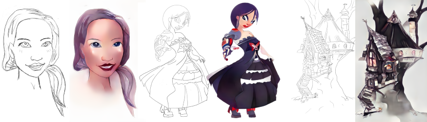
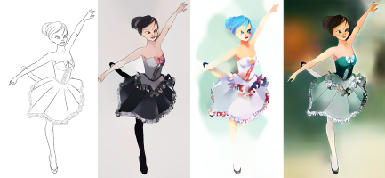
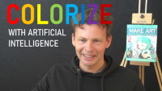
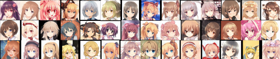
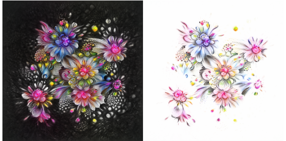
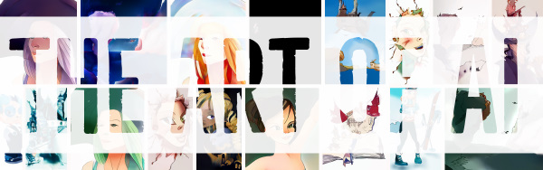

## MAKE ART with Artificial Intelligence
>How to use AI, NFT and Blockchain super-tools to make and sell your art. A richly illustrated tutorial on drawing sketching, inking, light, shading, coloring, face generation, animation and anything art with AI (check the book).

Book by Kevin Ashley ([https://www.amazon.com/dp/B08YXW7M9K](https://www.amazon.com/dp/B08YXW7M9K))

_**Amazon Bestseller in Neural Networks, Arts**_

## Practical experiments from the book

All illustrations in this book are created or augmented with AI and are available as NFTs on blockchain in this art collection [The Art of AI](https://opensea.io/collection/awesomeai). 

- [The Art of AI Collection](https://opensea.io/collection/awesomeai) - all art from my book is available as NFT. If you would like to own some of the artworks I made for this book, please [check it out](https://opensea.io/collection/awesomeai).
- [More video tutorials](http://awesomeai.vhx.tv) - More video tutorials made by the author.

**Note:** Most examples are available in playground environments like Google Colab and Binder. For standalone notebooks, it is recommended that your kernel environment is set to Python 3. Check [requirements.txt](requirements.txt) for dependencies. 

# Chapter 1. Getting Started

## Project 1.1 Drawing Sketches

In this project we begin by simply sketching a portrait, a pose of a human or an animal, and scene, a building or a landscape. Just draw anything you like, we'll use it later in the book. With this method by combining creativity and AI, we'll make beautiful illustrations, like these:

(see the [book](https://www.amazon.com/dp/B08YXW7M9K))

# Chapter 2. Creative Tools

## Project 2.1 Creative Tools and AI

In this project we begin by simply sketching a portrait, a pose of a human or an animal, and scene, a building or a landscape. Just draw anything you like, we'll use it later in the book.

- **Quick Draw** - Doodling with AI and predictive sketching. This is a great tool to understand how AI can predict what you are thinking to sketch! It also comes with Quick Draw dataset, collected from thousands of drawings! ( [Demo](https://quickdraw.withgoogle.com/) )
- **Photoshop Neural Filters**, and Adobe Sensei - is the classic digital tool’s window to AI creativity. Explore neural filters that Adobe engineers collected as part of Photoshop. ( [Article](https://helpx.adobe.com/photoshop/using/neural-filters.html) )
- **Clip Studio Paint AI Colorizing** – another classic illustration and drawing tool very popular with manga and anime artists. This tool includes AI colorizing that allows you to apply color to your sketches. We discuss AI based coloring in depth in this book. ( [Article](https://tips.clip-studio.com/en-us/articles/3939) )
- **Petalica Paint** ( [Demo](https://petalica-paint.pixiv.dev/index_en.html) )
- **OpenAI Microscope** – in this book we discuss neural networks. OpenAI came out with a great tool to visualize neural networks. This is a fantastic tool to understand how images get processed through different types of neural nets. ([Demo](https://openai.com/blog/microscope/))
- **Activation Atlases** ([Article](https://ai.googleblog.com/2018/03/the-building-blocks-of-interpretability.html), )

## Project 2.2 Getting Started with Notebooks

- Getting Started with Notebooks - Style Transfer (  ) - this is a basic introduction to using an online Colab notebook. No installation required, but a GPU kernel recommended. Very easy code with just a few steps. 

# Chapter 3. Neural Networks
(see the [book](https://www.amazon.com/dp/B08YXW7M9K))

## Project 3.1 Create a Single Neuron

- Make a Single Neuron ()

## Project 3.2 Neural Networks

- Make a Simple Neural Network ()
- Activation Functions ()
- Visualizing Neurons ()
- Activation Atlas ([Article](https://ai.googleblog.com/2018/03/the-building-blocks-of-interpretability.html) , ) 

## Project 3.3 Neural Methods

- Classification ()
- Detection ()
- Segmentation ()

# Chapter 4. Drawing and Sketching
(see the [book](https://www.amazon.com/dp/B08YXW7M9K))

## Project 4.1 Explore Sketching 

- **Quick Draw** - Doodling with AI and predictive sketching. This is a great tool to understand how AI can predict what you are thinking to sketch! It also comes with Quick Draw dataset, collected from thousands of drawings! ( [Demo](https://quickdraw.withgoogle.com/) )
- **Sketch RNN** ( [Demo](https://experiments.withgoogle.com/sketch-rnn-demo) )
- **Predicting the rest of the sketch** you can see a variety of different endings predicted by the model. ( [Demo](https://magenta.tensorflow.org/assets/sketch_rnn_demo/multi_predict.html) )
- **Morphing one sketch to another** the model will come up with new drawings that it believes to be the interpolation between the two original drawings ( [Demo](https://magenta.tensorflow.org/assets/sketch_rnn_demo/interp.html) )
- **Mimic your sketches** Rather than drawing a perfect duplicate copy of your drawing, the model will try to mimic your drawing instead. ( [Demo](https://magenta.tensorflow.org/assets/sketch_rnn_demo/multi_vae.html) )
- **Cartoonify** – turn your photo in a drawing, Google experiment ( [Demo](https://experiments.withgoogle.com/cartoonify) )
- **Monster Mash** - sketch based tool for 3D modeling and animation. This tool allows you to animate your sketch by inflating a 2D drawing to 3D and animating ([Demo](http://monstermash.zone/), [Article](https://ai.googleblog.com/2021/04/monster-mash-sketch-based-tool-for.html) )

## Project 4.2 Colorize your Sketch

- **Colorize Sketches** - great online model to get started with ()

**NEW! Video Tutorial: Colorize Your Sketch with A.I.**
 

Subscribe to video tutorials, every month I'll be adding new content.

- **Style2Paints** - one of the best tools for colorization, for best results this tool requires installation ([Docs](https://style2paints.github.io/) ,[Code](https://github.com/lllyasviel/style2paints))
- Colorize Photos ()
- Colorize GrayScale ()
- Colorize Sketch to Grayscale ()

## Project 4.3 More on Sketching

- Sketch from portraits (ArtLine) ( [Code](https://github.com/vijishmadhavan/ArtLine) , )
- Cartoons from Portraits ( [Code](https://github.com/vijishmadhavan/Toon-Me) ,  )
- Pix2Pix (  , [Code](https://github.com/phillipi/pix2pix) , [Demo](https://affinelayer.com/pixsrv/) )
- ShadeSketch ( [Paper](https://arxiv.org/abs/2002.11812) , [Demo](https://qyzdao.github.io/ShadeSketch/) , [Code](https://github.com/qyzdao/ShadeSketch) )
- Sketch Simplification ( [Paper](https://esslab.jp/~ess/en/research/sketch_master/) , [Code](https://github.com/bobbens/sketch_simplification) )
- Sketching Lines Refining ( [Code](https://github.com/hepesu/LineRelifer/) )
- Sketch based Deep Learning ( [Read more...](https://github.com/qyzdao/Sketch-Based-Deep-Learning) )
- Design and technical sketches [Sketch Graph](https://github.com/PrincetonLIPS/SketchGraphs)
- **Super-Resolution** enhance lower resolution images with AI ()
    
# Chapter 5. Faces and Expressions 

(see the [book](https://www.amazon.com/dp/B08YXW7M9K))

## Project 5.1 Face and Facial Features

- **Facial Detection** facial detection with Google MediaPipe ( [Docs](https://google.github.io/mediapipe) , )
- **Facial Features** facial features with Google MediaPipe ( [Docs](https://google.github.io/mediapipe) , )
- **Hair Recoloring** - Super realistic real time hair recoloring and segmentation. ( [Docs](https://google.github.io/mediapipe/solutions/hair_segmentation.html) )
- **Iris and Depth** - an amazing work that shows how to reconstruct depth from an iris. ( [Docs](https://google.github.io/mediapipe/solutions/iris.html) )

## Project 5.2 Generate Anime Faces

- **Generate Anime Faces** - this notebook shows how to use StyleGAN to generate anime faces. (  )
- **Photorealistic faces** with NVIDIA StyleGAN2 ( [Article](https://news.developer.nvidia.com/synthesizing-high-resolution-images-with-stylegan2/) , [Code](https://github.com/NVlabs/stylegan2) )
- **Generate Cartoon Faces with Customization** - this notebook uses StyleGAN2 to create customizable cartoon faces based on Cartoon Set (  )
- **Training StyleGAN model on portraits** train StyleGAN to generate portraits **long, advanced** ( [Docs](https://google.github.io/mediapipe) , )
- **This Anime Does not Exist** is a great exploration tool for anime generation ( [This Anime Does Not Exist](https://thisanimedoesnotexist.ai) )

# Chapter 6. Body and Poses 

## Project 6.1 Poses and Actions

- **Detecting Body Keypoints** using PyTorch ( )
- **Body Pose Estimation** using MediaPipe and a 1790 painting _The Reverend Robert Walker Skating on Duddingston Loch_, better known by its shorter title The Skating Minister, an oil painting attributed to Henry Raeburn  ( )
- **Pose in 3D** with DensePose( )
- **Reconstructing 3D** with human iris - an amazing work that shows how to reconstruct depth from an iris. ( [Docs](https://google.github.io/mediapipe/solutions/iris.html) )
- **Fashion and Clothing** classifying fashion and clothing (  )
- **High Resolution 3D Human Digitization** (  , [Paper](https://shunsukesaito.github.io/PIFuHD/))

## Project 6.2 Pose Tools for 3D in Art

1. Get assets for this example from [The Art of AI Collection](https://opensea.io/collection/awesomeai) Practical Pose Kit.These assets include a ClipStudio Paint and a Photoshop file. 
2.	Open ClipStudio Paint file with the illustration and select 3D Painter layer (marked with a cube)
3.	Play with changing painter’s avatar position and orientation. Note that the avatar pose includes constraints on joint movements that somewhat correspond to anatomical joints, but you still have the flexibility.
4.	Once you’re happy with the avatar pose, you reduce level opacity to 15-20%, start a new layer, choose your favorite ink pen or a pencil and trace the avatar.

# Chapter 7. Animation 

## Project 7.1 Animating Characters

- **Animate a pose/face illustration** Download pose illustration assets from [The Art of AI Collection](https://opensea.io/collection/awesomeai) - look for **Pose Animation Asset Kit**. Use [Pose Animator](https://pose-animator-demo.firebaseapp.com/camera.html) to animate the SVG.
- **Pose Animator** check this fantastic work to animate your illustrations. ( [Demo - Camera](https://pose-animator-demo.firebaseapp.com/camera.html) , [Demo - Image](https://pose-animator-demo.firebaseapp.com/static_image.html) , [Code](https://github.com/yemount/pose-animator)  )

## Project 7.2 Animation Examples

- **Animating Faces - Lips with LipGAN** (  )
- **Animating Faces - Lips with Wave2Lip** ( [Demo](https://bhaasha.iiit.ac.in/lipsync) , [Code](https://github.com/Rudrabha/Wav2Lip) , )
- First Order Motion Model for Image Animation ([Paper](https://arxiv.org/pdf/2003.00196.pdf))
- An Illusion of Life ([Book](https://www.amazon.com/gp/product/0786860707))
- Animator's Survival Kit ([Book](https://www.amazon.com/Animators-Survival-Kit-Principles-Classical/dp/086547897X))
- Pose Animator (Faces and Poses)( [Article](https://blog.tensorflow.org/2020/05/pose-animator-open-source-tool-to-bring-svg-characters-to-life.html) , [Code](https://github.com/yemount/pose-animator) , [Demo](https://pose-animator-demo.firebaseapp.com/camera.html))
- Animating Loss Landscapes ( [Article](https://towardsdatascience.com/animations-of-gradient-descent-and-loss-landscapes-of-neural-networks-in-python-e757f3584057) , [Code](https://github.com/BundleOfKent/Animations-of-Logistic-Regression/blob/main/Animations_LogisticRegression.ipynb) )
- **Monster Mash** - sketch based tool for 3D modeling and animation. This tool allows you to animate your sketch by inflating a 2D drawing to 3D and animating ([Demo](http://monstermash.zone/), [Article](https://ai.googleblog.com/2021/04/monster-mash-sketch-based-tool-for.html) )
 
# Chapter 8. Landscapes and Scenery
 
## Project 8.1 Examples

- **Image Generation and Interpolation** check how to generate images with BigGAN, including interpolations - note the interpolation from a cruise liner ship to a monastery!  ( )
- Landscape Painting with Generative Adversarial Networks ([Article](https://arxiv.org/abs/2011.05552))
- **GauGAN - AI as a smart brush** - NVIDIA project ([Demo](https://www.nvidia.com/en-us/research/ai-playground/))

# Chapter 9. Style and Creativity

## Project 9.1 Style, Compositions and Patterns

- Patterns (  , [Article](https://distill.pub/2018/differentiable-parameterizations/) )
- Transparency and Patterns ()
- Exaggerating Features (Cartoonification)  (  )
- Activation Atlas ( 
- Style Transfer([Original Colab](https://colab.research.google.com/github/tensorflow/lucid/blob/master/notebooks/differentiable-parameterizations/style_transfer_2d.ipynb) ,  [Colab](https://colab.research.google.com/drive/1Yia9N6r3sMK04zjFAJUqD3GA4XPA4Qjz))
- Text to Illustration (Deep Daze) - OpenAI CLIP and SIREN (  ) 
- Text to Illustration (Big Sleep) - OpenAI CLIP and BigGAN (  ) 
- Style Transfer (  ) 
- Style Transfer with Blending Proportions (  )
- Style Transfer Parametrizations (  )
- Generating Images with BigGAN (  )
- WikiArt Model Artwork Trained (  )
- Artwork Trained Model (  )

- Style Transfer
    - Fast Style Transfer ([Code](https://github.com/lengstrom/fast-style-transfer))
    - Generative Style Transfer ([Tensorflow](https://www.tensorflow.org/tutorials/generative/style_transfer))
- Generating Images from Text
    - Generating Images from Text ([DALL-E](https://openai.com/blog/dall-e))
- Generating Anime Faces    
  - Anime Faces Generation ([Article](https://www.gwern.net/TWDNE))
- Fashion
  - Fashion [Tool](https://app.runwayml.com/models/ALANIX/Fashion-Illustrations) , [Code](https://colab.research.google.com/drive/1zRt7bKlH6sHeo3anHwvVnz6Z_0YToWb7) 
- 3D Models
    - [Article](https://nv-tlabs.github.io/DIB-R/)

# The Art of AI

All illustrations from this book are available in [The Art of AI Collection](https://opensea.io/collection/awesomeai) on block chain. If you collect digital art, this collection contains original digital illustrations, sketches and more. 

[Art of AI NFT Gallery](https://opensea.io/collection/awesomeai)

[Book on Amazon](https://www.amazon.com/dp/B08YXW7M9K)

